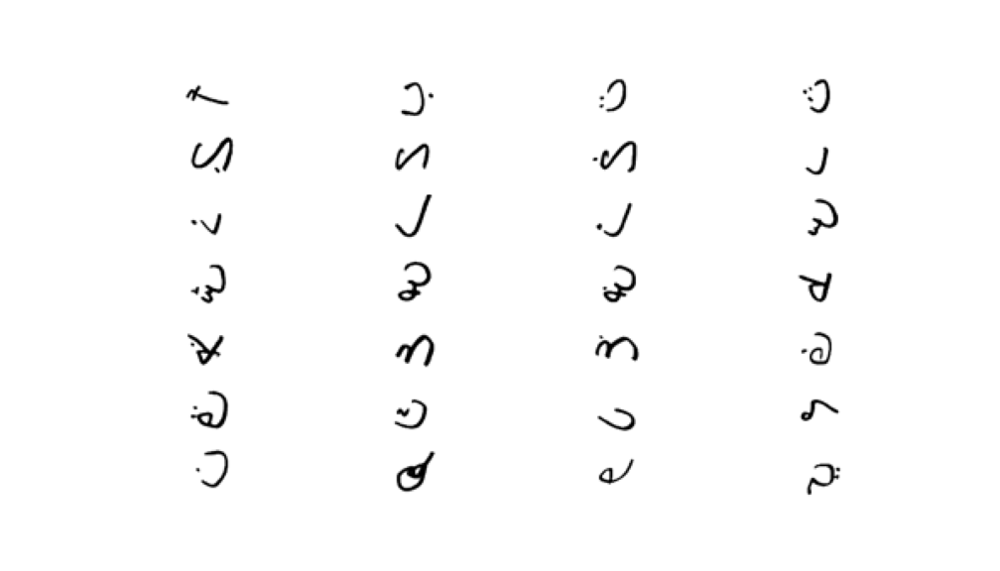

# Arabic-Character-recognition-
building Arabic Handwritten Characters recognition system. 

### Project Overview
A learning algorithm is proposed for the tast of Arabic Handwritten Characters. In this project, I worked on a dataset that collected and published in [Deep learning autoencoder approach for handwritten arabic digits recognition.](https://arxiv.org/abs/1706.06720) by Loey, Mohamed, Ahmed El-Sawy, and Hazem El-Bakry and you can find the [Arabic Handwritten Characters Dataset](https://www.kaggle.com/mloey1/ahcd1) on kaggle.
The data is composed of 16,800 characters and it is divided into two sets: a training set (13,440 characters to 480 images per class) and a test set (3,360 characters to 120 images per class). The research team showed that the results were promising with 94.9% classification accuracy rate on testing images. on the same Dataset, I designed, tuned and trained an architecture that has 96.37% accuracy on testing set. 



### Code

Template code is provided in the `Arabic_character_recognition.ipynb` notebook file as a whole project. and it is divided into 3 python scripts `data.py`, `models.py`, and `main.py`.

### Install

This project requires **Python 3** and the following Python libraries installed:

- [NumPy](http://www.numpy.org/)==1.19.5
- [Pandas](http://pandas.pydata.org)==1.1.2
- [scikit-learn](http://scikit-learn.org/stable/)
- [Keras](https://keras.io/)

**Notice**
	You may also need to have software installed to run and execute an [iPython Notebook](http://ipython.org/notebook.html) or install [Anaconda](https://www.continuum.io/downloads), a pre-packaged Python distribution that contains all of the necessary libraries and software for this project.

### Run

In a terminal or command window, navigate to the top-level project directory `Arabic-Character-recognition/` (that contains this README) and run one of the following commands:

```bash
ipython notebook Arabic_character_recognition.ipynb
```  
or
```bash
jupyter-notebook Arabic_character_recognition.ipynb
```

This will open the iPython Notebook software and project file in your browser.


